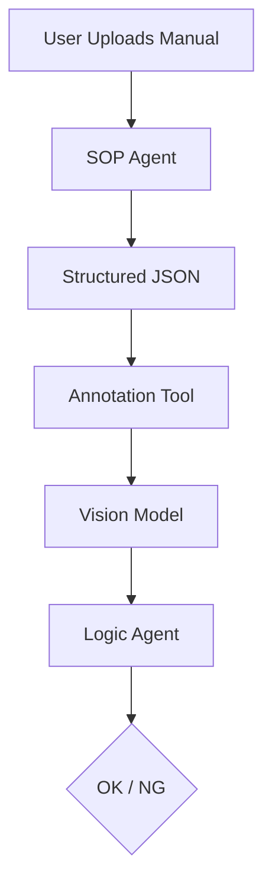

# iFixit SOP Pipeline & Training Toolkit

A complete pipeline for automating **Standard Operating Procedures (SOPs)** using Large Language Models (LLMs) and Computer Vision. This toolkit downloads data from iFixit, trains specialized agents, and runs a runtime verification system.

## 🚀 Features

*   **SOP Agent (LLM)**: Parses raw manual text into structured JSON (Steps, Logic, Classes).
*   **Annotation Copilot (VLM)**: Pre-annotates images using SOTA Vision Models (Grounding DINO, SAM 2) trained on iFixit data.
*   **Logic Agent**: Verifies steps at runtime based on vision telemetry (e.g., "Are all 4 screws removed?").
*   **iFixit Downloader**: Robust scraper to fetch guides, images, and metadata for training.

## 📂 Project Structure

```
.
├── data/                   # Downloaded datasets (JSONL)
├── ifixit_downloader.py    # Main script to fetch iFixit data
├── inspect_guide.py        # Helper to analyze guide structure
├── training_requirements.md # Hardware & Training guide
├── implementation_plan.md  # System Architecture Design
└── walkthrough.md          # Detailed system walkthrough
```

## 🛠️ Installation

1.  **Clone the repository**:
    ```bash
    git clone https://github.com/tefj-fun/ifixit-sop-pipeline.git
    cd ifixit-sop-pipeline
    ```

2.  **Install dependencies**:
    ```bash
    pip install requests
    ```

## 📖 Usage

### 1. Download Training Data
Run the downloader to fetch guides and save them as `data/ifixit_dataset.jsonl`.
```bash
python ifixit_downloader.py
```
*   *Note*: You can modify the `queries` list in the script to target specific categories (e.g., "Washing Machine", "Toyota Camry").

### 2. Train Your Agents
Refer to **[training_requirements.md](training_requirements.md)** for a detailed guide on hardware needs (VRAM) and recommended libraries (`unsloth`, `supervision`).

*   **SOP Agent**: Fine-tune Llama 3 / Mistral on the `instruction` -> `logic` pairs in the dataset.
*   **Vision Model**: Pre-train Grounding DINO / SAM 2 on the downloaded images + weak labels (bullet colors).

## 🏗️ Architecture



## 📄 License
This project is for educational purposes. iFixit content is licensed under CC-BY-NC-SA 3.0.
